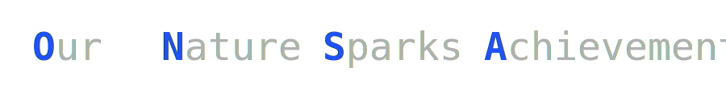

<h1 align="center"></h1>
<h1 align="center">Hello, I'm Onsa Bezzine</h1>

<h3 align="center">Full Stack Java & Angular Developer | Passionate about Clean Code, and Real-World Solutions </h3>

  

### About Me

- Engineer with strong academic background in **Software Engineering**
- Specialized in **Full Stack Java & Angular development**
- Passionate about **clean architecture**, **real-world applications**, and **DevOps best practices**
- Building and contributing to open-source projects while preparing for professional opportunities

---

### Technical Skills

- **Backend**: Java, Spring Boot, Spring Security, RESTful APIs, JWT Authentication, JPA, Hibernate
- **Frontend**: Angular, ReactJS, TypeScript, JavaScript, RxJS, Angular Material, Bootstrap, HTML, CSS
- **DevOps & CI/CD**: Docker, Git, GitHub Actions, Maven
- **Databases**: MySQL, MongoDB
- **Networking & Security**: Solid foundations in computer networking and network security (CCNA 2 certified), firewalls, VPNs, TCP/IP, OSI model, basic ethical hacking
- **Tools & IDEs**: VS Code, IntelliJ IDEA, Spring Tool Suite (STS), Postman, Figma 4
- **Testing & Debugging**: Unit testing (JUnit), Debugging, Logging,
- **Methodologies**: Agile (Scrum), version control workflows (Git/GitHub)
  
### Certifications
- Cisco CCNA 2: Switching, Routing, and Wireless Essentials
  
---

### 🚀 Projects

#### 1. **Mailbox Automation**
Asynchronous email receiver and processor using Spring Integration & JavaMail.

- **Backend**: Spring Boot 3.2.1, Spring Integration, JavaMail
- **Features**:
  - Receive and process emails via IMAP
  - Extract content, download attachments
  - Logs & moves processed mails to folders
- **Configuration**: YAML-based with thread pool tuning and secure IMAP setup

  
#### 2. **Employee Management System**
A full-stack CRUD application for managing employee data.

- **Backend**: Spring Boot, Spring Data JPA, MySQL
- **Frontend**: React, Axios, Bootstrap  
- **Features**:
  - View, add, update, and delete employees
  - RESTful API integration
- **Endpoints**:
  - `GET /api/v1/employees`
  - `POST /api/v1/employees`
  - `GET /api/v1/employees/{id}`
  - `PUT /api/v1/employees/{id}`
  - `DELETE /api/v1/employees/{id}`

#### 3. **Academic Projects (Private Repos)**
Created and developed as part of my final year project studies.

- Topics: Olympic committee digitalization
- Tech Stack: Spring Boot, Angular, MySQL
- *Note*: Repositories are private due to academic restrictions but reflect strong architectural design and teamwork experience

---

> “Code is not just about syntax — it's about solving problems, creating impact, and learning every day.”

